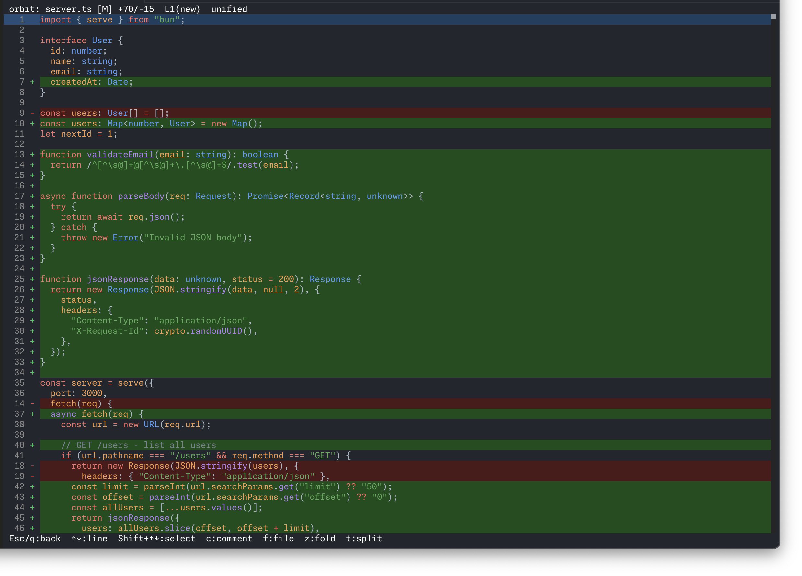

# orbit (Offline Review Board In Terminal)

<p align="center">
  
</p>

A terminal-based code review tool. Browse git diffs, leave comments on specific lines, then export everything as a prompt you can paste into Claude Code or any other AI tool.

## Why

Code review in the terminal is fast but you lose the ability to annotate. GitHub PRs let you comment but require a browser and a remote. orbit sits in between: you get a full diff viewer with line-level comments, all from your terminal, all offline.

The key trick is the prompt export. Your review comments become a structured prompt that an AI coding assistant can act on directly. Review a diff, jot down what needs fixing, copy the prompt, paste it, done.

## Screenshots

**Home screen** -- file tree with diff preview


**Diff view** -- unified diff with syntax highlighting, fold/unfold



**Split view** -- side-by-side comparison


**Comment** -- add review comments on any line


## Install

Requires [Bun](https://bun.sh) v1.2+.

```sh
git clone https://github.com/Hoshock/orbit.git
cd orbit
bun install
bun run register   # symlinks bin/orbit to ~/.local/bin/orbit
```

Make sure `~/.local/bin` is in your `PATH`.

## Usage

```sh
orbit                     # unstaged changes (git diff)
orbit staged              # staged changes (git diff --staged)
orbit HEAD                # last commit
orbit HEAD~3..HEAD        # commit range
orbit feature main        # branch comparison
orbit --split             # side-by-side view
```

## Keybindings

### File list

| Key          | Action                        |
| ------------ | ----------------------------- |
| `Up/Down`    | Move cursor                   |
| `Left/Right` | Collapse/expand directory     |
| `Enter`      | Open diff or toggle directory |
| `Space`      | Toggle file as viewed         |
| `c`          | Comment list                  |
| `P`          | Prompt preview                |
| `t`          | Toggle split/unified          |
| `q`          | Quit                          |

### Diff view

| Key             | Action                               |
| --------------- | ------------------------------------ |
| `Up/Down`       | Move by line                         |
| `Shift+Up/Down` | Select range                         |
| `Left/Right`    | Switch side (split mode)             |
| `c`             | Comment on current line or selection |
| `f`             | File-level comment                   |
| `e`             | Edit comment at cursor               |
| `d`             | Delete comment at cursor             |
| `z`             | Fold/unfold context                  |
| `t`             | Toggle split/unified                 |
| `Esc`           | Back to file list                    |

### Comment input

| Key          | Action |
| ------------ | ------ |
| `Ctrl+Enter` | Submit |
| `Esc`        | Cancel |

### Prompt preview

| Key   | Action                   |
| ----- | ------------------------ |
| `y`   | Copy prompt to clipboard |
| `Esc` | Back                     |

## How the prompt works

Each comment you leave records the file path, line number, which side of the diff (old/new), and the code at that line. When you press `P` to preview and `y` to copy, orbit formats all of this into a single text block:

```
src/app.tsx:L42 (a1b2c3d)
This function should handle the edge case where files is empty.
==========
src/utils/git.ts:L15-L20 (a1b2c3d)
Extract this into a helper, it's duplicated in three places.
```

Paste that into Claude Code (or any LLM) and it has enough context to act on each comment.

## Stack

- [Bun](https://bun.sh) - runtime and test runner
- [OpenTUI](https://github.com/anthropics/opentui) - terminal UI framework (React-based)
- [React](https://react.dev) - component model
- [Biome](https://biomejs.dev) - linter and formatter

## Development

```sh
bun run start             # run from source
bun test                  # run tests
bun run check             # lint + build check
bun run lint              # auto-fix lint issues
```

## License

MIT
