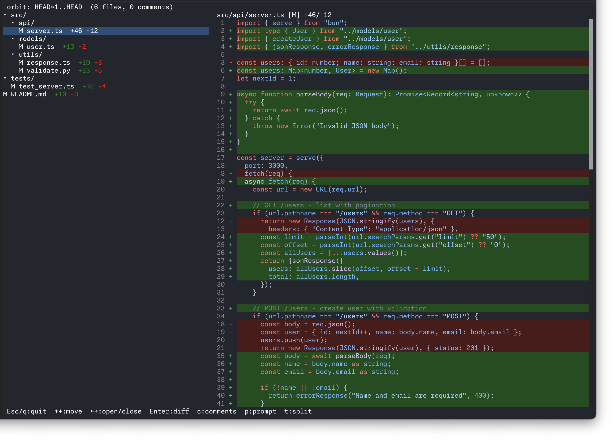
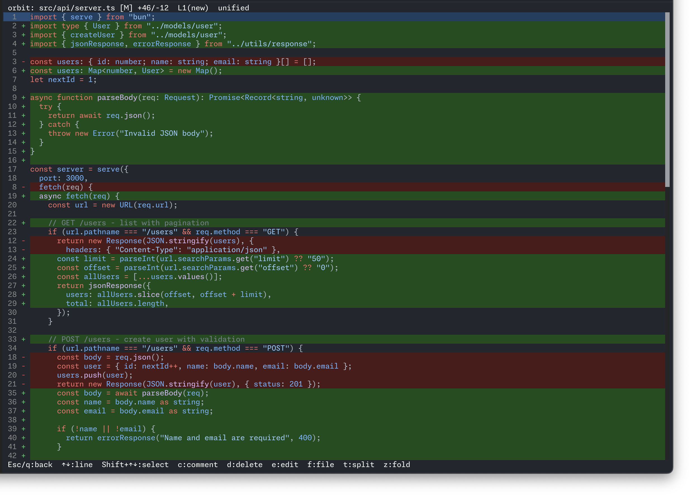
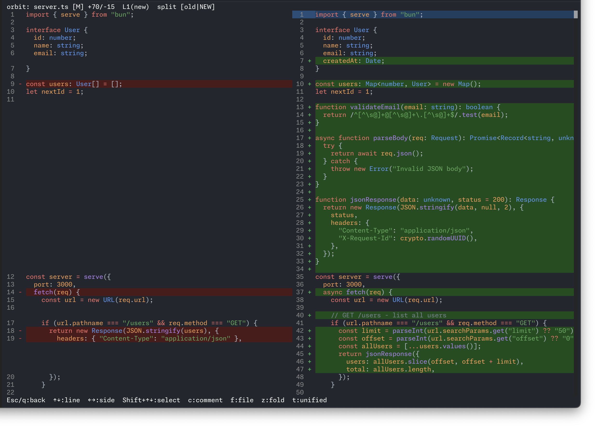
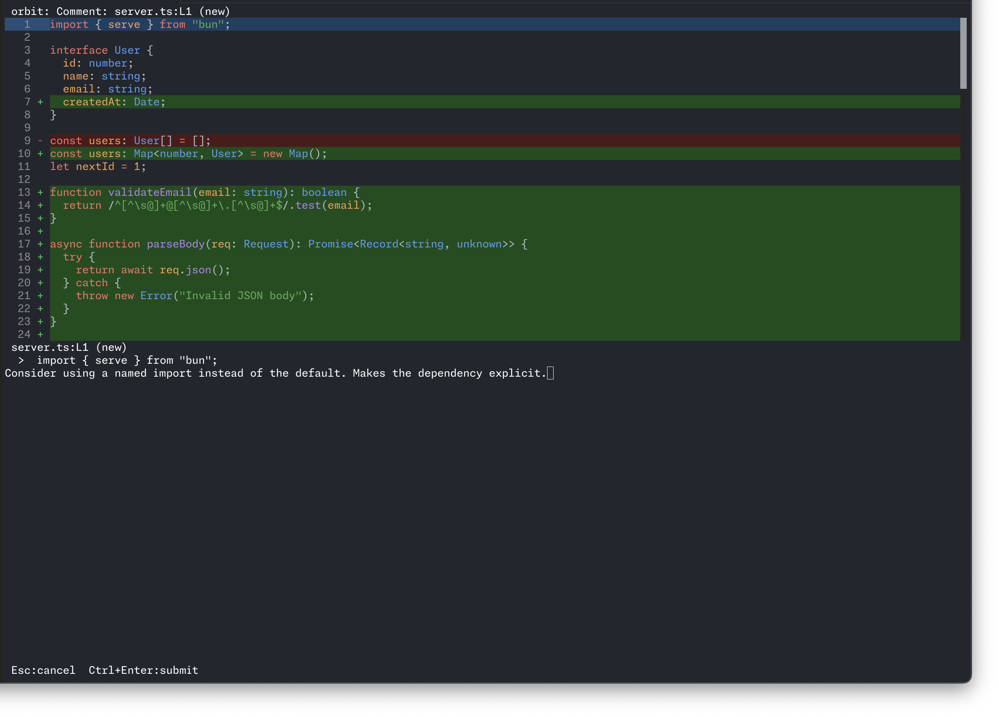
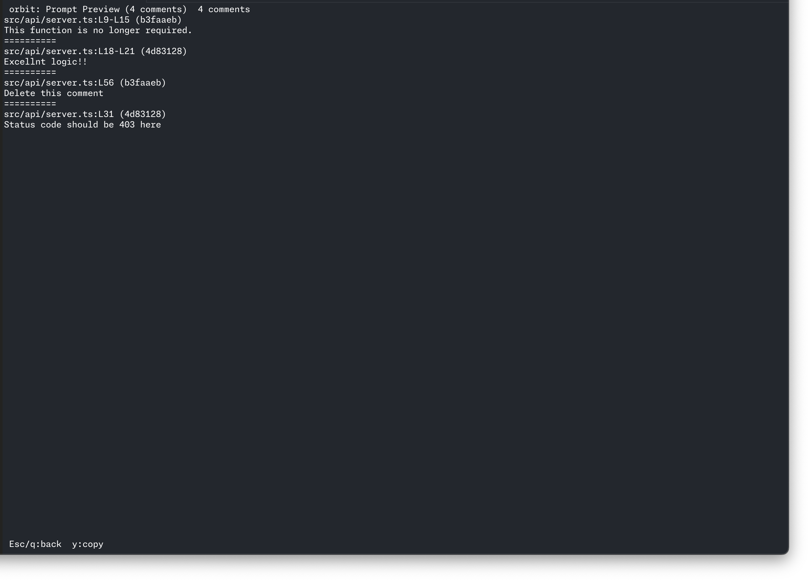

# orbit (Offline Review Board In Terminal)

<p align="center">
  
</p>

A terminal-based code review tool. Browse git diffs, leave comments on specific lines, then export everything as a prompt you can paste into Claude Code or any other AI tool.

## Why

Inspired by [difit](https://github.com/yoshiko-pg/difit), a great browser-based local diff viewer. Commenting on lines works in the browser, but not yet in the TUI. I wanted a fully terminal-native diff reviewer with line-level comments, a customizable syntax highlighting theme, split view, and a prompt export workflow for AI coding assistants -- so I built orbit.

The key trick is the prompt export. Your review comments become a structured prompt that an AI coding assistant can act on directly. Review a diff, jot down what needs fixing, copy the prompt, paste it, done.

## Screenshots

**Home screen** -- file tree with diff preview



**Unified view** -- unified diff with syntax highlighting, fold/unfold



**Split view** -- side-by-side comparison



**Comment** -- add review comments on any line



**Prompt preview** -- export comments as a structured prompt



## Install

Requires [Bun](https://bun.sh) v1.2+.

```sh
git clone https://github.com/Hoshock/orbit.git
cd orbit
bun install
bun run register   # symlinks bin/orbit to ~/.local/bin/orbit
```

Make sure `~/.local/bin` is in your `PATH`.

## Usage

```sh
orbit                     # unstaged changes (git diff)
orbit staged              # staged changes (git diff --staged)
orbit HEAD                # last commit
orbit HEAD~3..HEAD        # commit range
orbit feature main        # branch comparison
orbit --split             # side-by-side view
```

## Keybindings

### File list

| Key          | Action                        |
| ------------ | ----------------------------- |
| `q/Esc`      | Quit                          |
| `Up/Down`    | Move cursor                   |
| `Left/Right` | Collapse/expand directory     |
| `Enter`      | Open diff or toggle directory |
| `c`          | Comment list                  |
| `p`          | Prompt preview                |
| `t`          | Toggle split/unified          |

### Diff view

| Key             | Action                               |
| --------------- | ------------------------------------ |
| `Esc/q`         | Back to file list                    |
| `Up/Down`       | Move by line                         |
| `Left/Right`    | Switch side (split mode)             |
| `Shift+Up/Down` | Select range                         |
| `c`             | Comment on current line or selection |
| `d`             | Delete comment at cursor             |
| `e`             | Edit comment at cursor               |
| `f`             | File-level comment                   |
| `t`             | Toggle split/unified                 |
| `z`             | Fold/unfold context                  |

### Comment input

| Key          | Action |
| ------------ | ------ |
| `Esc`        | Cancel |
| `Ctrl+Enter` | Submit |

### Comment list

| Key       | Action            |
| --------- | ----------------- |
| `Esc/q`   | Back to file list |
| `Up/Down` | Move cursor       |
| `Enter`   | Jump to comment   |
| `d`       | Delete comment    |
| `e`       | Edit comment      |

### Prompt preview

| Key     | Action                   |
| ------- | ------------------------ |
| `Esc/q` | Back                     |
| `y`     | Copy prompt to clipboard |

## How the prompt works

Each comment you leave records the file path, line number, which side of the diff (old/new), and the code at that line. When you press `p` to preview and `y` to copy, orbit formats all of this into a single text block:

```
src/app.tsx:L42 (a1b2c3d)
This function should handle the edge case where files is empty.
==========
src/utils/git.ts:L15-L20 (a1b2c3d)
Extract this into a helper, it's duplicated in three places.
```

Paste that into Claude Code (or any LLM) and it has enough context to act on each comment.

## Comment persistence

Comments are automatically saved to `/tmp` on every add, edit, and delete. When you reopen orbit with the same diff range, your comments are restored.

- Cache file: `/tmp/orbit-<repo>-<hash>.json`
- The hash is derived from the diff range (e.g., `HEAD~1..HEAD`), so different ranges get separate caches
- Cache files live in `/tmp` and are cleared on OS restart

## Stack

- [Bun](https://bun.sh) - runtime and test runner
- [OpenTUI](https://github.com/anthropics/opentui) - terminal UI framework (React-based)
- [React](https://react.dev) - component model
- [Biome](https://biomejs.dev) - linter and formatter

## Development

```sh
bun run start             # run from source
bun test                  # run tests
bun run check             # lint + build check
bun run lint              # auto-fix lint issues
```

## Syntax highlighting

orbit uses [tree-sitter](https://tree-sitter.github.io/) for syntax highlighting. The following languages are currently supported:

| Language   | Source                                         |
| ---------- | ---------------------------------------------- |
| JavaScript | OpenTUI built-in                               |
| TypeScript | OpenTUI built-in                               |
| Markdown   | OpenTUI built-in                               |
| Zig        | OpenTUI built-in                               |
| Python     | Bundled grammar (`assets/tree-sitter/python/`) |

### Adding a new language

1. **Get the `.wasm` grammar and `highlights.scm`**

   ```sh
   mkdir -p assets/tree-sitter/<language>

   # Prebuilt wasm from unpkg
   curl -L "https://unpkg.com/tree-sitter-wasms@latest/out/tree-sitter-<language>.wasm" \
     -o assets/tree-sitter/<language>/tree-sitter-<language>.wasm

   # Highlight queries from the official tree-sitter grammar repo
   curl -L "https://raw.githubusercontent.com/tree-sitter/tree-sitter-<language>/master/queries/highlights.scm" \
     -o assets/tree-sitter/<language>/highlights.scm
   ```

   Verify the `.wasm` starts with `\0asm` (not a 404 page): `xxd ... | head -1`

2. **Register the parser in `src/index.tsx`**

   ```tsx
   import langWasm from "../assets/tree-sitter/<language>/tree-sitter-<language>.wasm" with { type: "file" };
   import langHighlights from "../assets/tree-sitter/<language>/highlights.scm" with { type: "file" };
   ```

   Then add an entry to the `addDefaultParsers()` call:

   ```tsx
   addDefaultParsers([
     // ... existing entries
     {
       filetype: "<language>",
       wasm: resolve(__dir, langWasm),
       queries: { highlights: [resolve(__dir, langHighlights)] },
     },
   ]);
   ```

3. **Ensure `filetype.ts` has the mapping** — `src/utils/filetype.ts` maps file extensions to language names. Add an entry if it doesn't exist yet.

4. **Add a LICENSE file** — Place a `LICENSE` in `assets/tree-sitter/<language>/` with the MIT notice from the grammar repo. See `assets/tree-sitter/python/LICENSE` for the format.

5. **Verify** — `bun run check` should show the new `.wasm` and `.scm` in the build output.

## License

MIT
